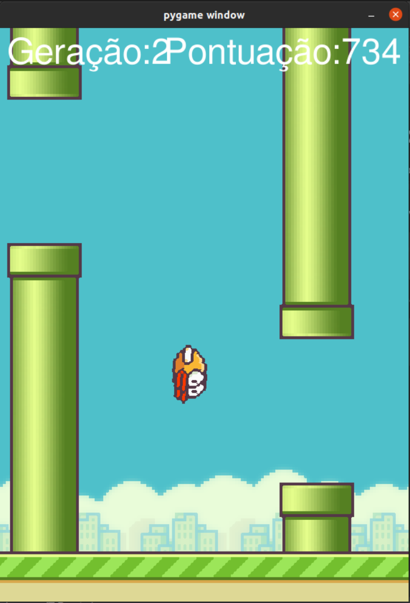

# Flappy-Bird---I.A

Construção do jogo Flappy Bird e mostrando o poder do Python ao ensinar o computador a zerar o jogo por meio de
inteligência artificial.

Comece pelo básico, e a cada dia acrescente algo novo.

Passo a passo:

1 - Criar e ativar o ambiente virtual no Pycharm

```console
python3 -m venv .venv
source .venv/bin/activate
```

2 - Bibliotecas necessárias para rodar esse projeto.

```console
pip install pygame
pip install neat-python
```

Imagens do jogo:

<div>

</div>